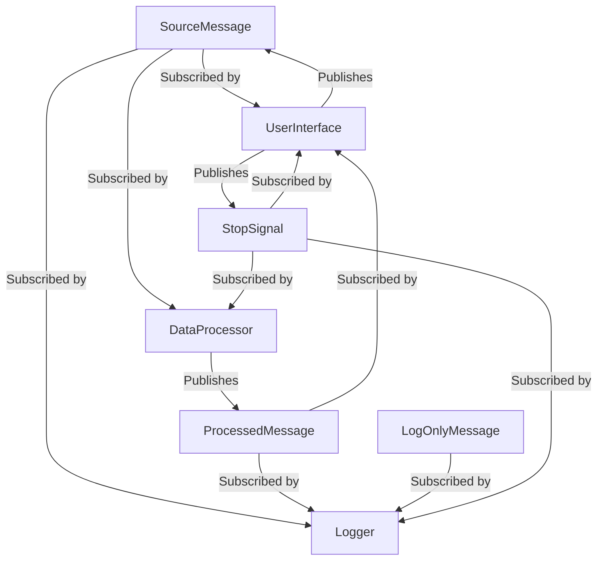

# Demo 3 Messages and Module Interactions

This diagram shows the different message types (SourceMessage, ProcessedMessage, LogOnlyMessage, and StopSignal) and which modules can publish or subscribe to each message type.
