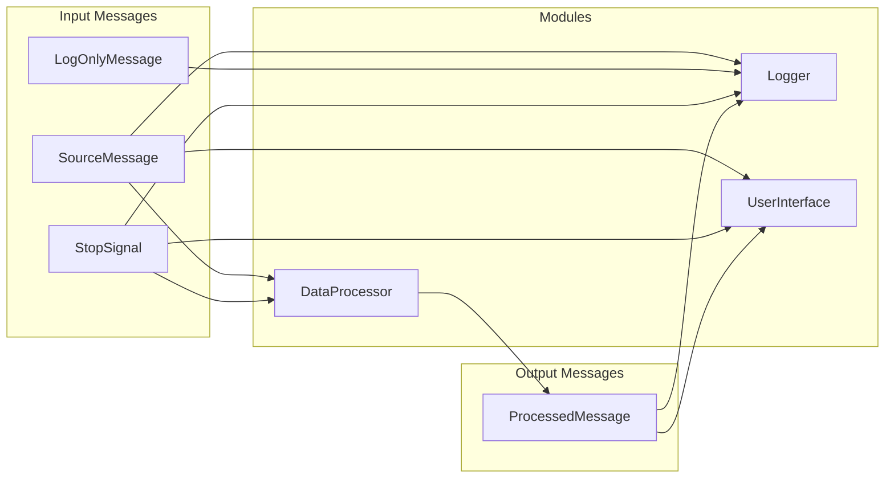

# Demo 3 Module-Message Interaction Diagram

This diagram illustrates the interaction between message types and modules in the Demo 3 application.

This diagram shows:
- Input message types on the left
- Application modules in the center
- Output message types on the right
- Lines indicating which modules interact with which message types

Note: The actual interactions may be more complex; this diagram provides a high-level overview.
