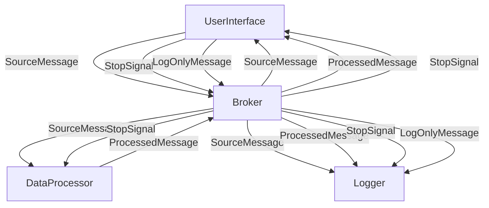

# Demo 3 Modules and Message Flow

This diagram shows the main modules (UserInterface, DataProcessor, and Logger) and how they interact through the Broker. The arrows represent the flow of different message types between the modules.
