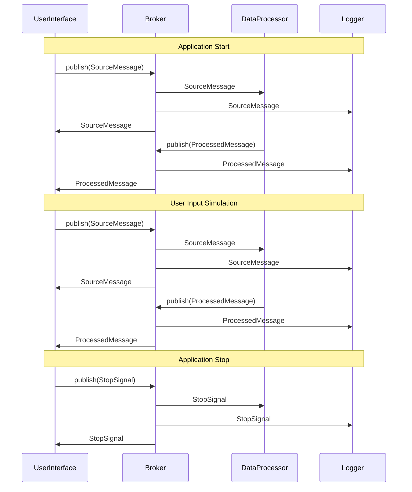

# Demo 3 Sequence Diagram

This sequence diagram shows the flow of messages between the UserInterface (UI), Broker (B), DataProcessor (DP), and Logger (L) modules over time. It includes the main message types (SourceMessage, ProcessedMessage, and StopSignal) and shows how they are published and distributed through the Broker.
