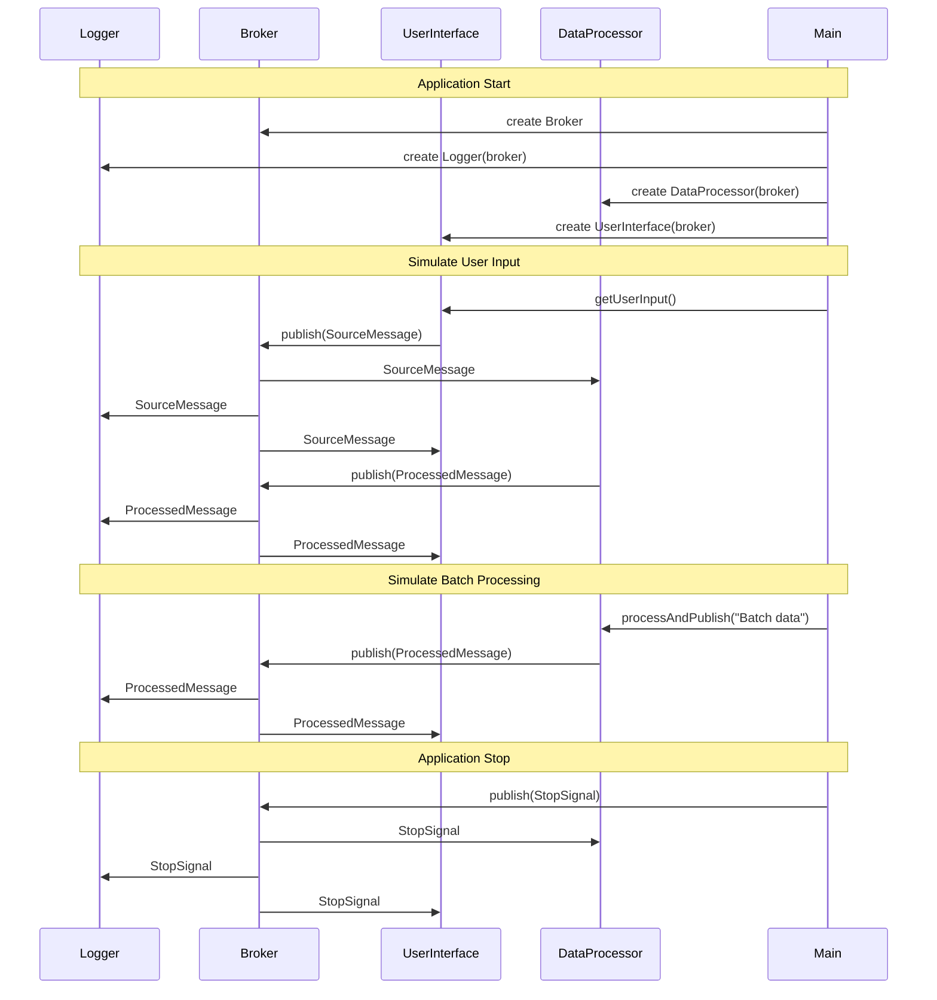

# Demo 3 Sequence Diagram

This sequence diagram now shows the flow of messages between Main (M), UserInterface (UI), Broker (B), DataProcessor (DP), and Logger (L) modules over time, accurately reflecting the structure in demo3.cpp.
